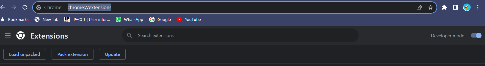

# url_saver
<h1>How to use Extension</h1>
  <ul>
    <li>Download the Files in a new folder</li>
    <li>Open <a href="chrome://extensions/"> chrome://extensions/</a></li>
    <li>
      Switch on Developer Mode  
      
    </li>
    <li>
      Click on "Load unpacked" And Select Folder
    </li>
  </ul>
